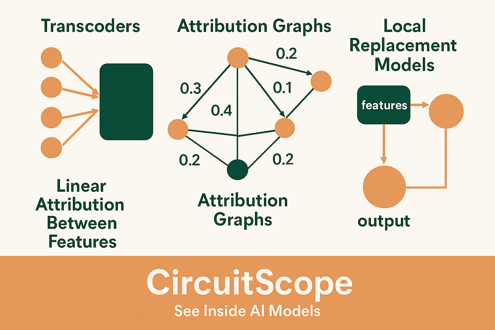

# CircuitScope: See Inside AI Models 🔬
<p align="center">
  
</p>

<h1 align="center">CircuitScope: See Inside AI Models 🔬</h1>

<p align="center">
  <strong>Transform AI from black box to glass box</strong><br>
  Making neural network decisions interpretable and trustworthy
</p>

---

## Table of Contents

- **[Overview](#overview)**
  - [The Problem We Solved](#the-problem-we-solved)
  - [What CircuitScope Does](#what-circuitscope-does)
- **[Technical Deep Dive](#technical-deep-dive)**
  - [Implementation](#implementation)
  - [Key Achievements](#key-achievements)
  - [Technical Stack](#technical-stack)
- **[Getting Started](#getting-started)**
  - [Prerequisites](#prerequisites)
  - [Snowflake Setup](#snowflake-setup)
  - [Running CircuitScope](#running-circuitscope)
- **[Future & Learning](#future--learning)**
  - [Lessons Learned](#lessons-learned)
  - [Future Roadmap](#future-roadmap)

---

## Overview

### The Problem We Solved

#### Black Box Challenge
Neural networks are effectively opaque systems: even their designers can't reliably explain why a model like ChatGPT invents facts or rejects valid prompts. Inputs are mapped into vast, nonlinear webs of latent feature activations across millions or billions of parameters, tiny changes can cascade through these interactions, producing outputs whose causal pathways are hidden in high-dimensional computations. That opacity — emergent, distributed, and sensitive to context — is why we need tools that trace, quantify, and visualize the actual influence chains inside a model.

#### Industry Impact
This opacity blocks AI deployment in critical sectors where explainability is mandatory:
- **Healthcare**: Doctors need to understand why an AI recommends a specific diagnosis
- **Finance**: Regulators require explanations for loan approval decisions
- **Legal**: Courts demand transparency in AI-assisted judgments
- **Autonomous Systems**: Safety certification requires traceable decision paths

#### Computational Barrier
Anthropic's Attribution Graphs paper offered a breakthrough in understanding AI decisions, but came with massive requirements:
- Days of GPU computation for single analyses
- Billions of training tokens
- Complex infrastructure for model instrumentation
- Prohibitive costs for researchers and small organizations

#### Our Solution
We created CircuitScope as a lightweight baseline that democratizes AI interpretability:
- Implements all major techniques from the paper
- Runs on small transformers (183K parameters)
- Completes analysis in under 15 minutes on CPU
- Maintains mathematical rigor while achieving practical efficiency

### What CircuitScope Does

CircuitScope acts as an "X-ray for AI," revealing which internal features activate and how they influence predictions through:

#### Core Capabilities
- **Decision Path Tracing**: Maps how input tokens flow through network features to become outputs
- **Feature Discovery**: Identifies interpretable units like "acronym detectors" or "number magnitude" features
- **Attribution Graph Building**: Creates visual influence maps with quantified scores
- **Model Debugging**: Pinpoints exactly which features cause hallucinations or failures
- **Efficient Execution**: Minutes on CPU vs. days on GPU clusters

#### Real Example
When completing "The National Digital Analytics Group (N" → "DAG)", CircuitScope reveals three parallel paths—one for each word's first letter—converging into an "acronym completion" feature.

---

## Technical Deep Dive

### Implementation

#### Architecture Components

**Custom Activation Function**
- **JumpReLU**: Sparse activation with learnable thresholds enabling feature interpretability through controlled sparsity.

**Cross-Layer Transcoders (CLT)**
- Multi-layer sparse autoencoders decomposing MLP computations into interpretable features across network layers.

**Attribution Framework**
- **Frozen LayerNorm**: Maintains linear attribution paths by freezing normalization denominators
- **Virtual Weights**: Mathematical framework enabling cross-layer feature communication
- **Backward Jacobian**: Computes gradients through the entire model for influence tracking

#### Advanced Algorithms

**TWERA (Time-Weighted Expected Residual Attribution)**
- Probabilistic weighting based on feature co-activation patterns to improve attribution accuracy.

**Indirect Influence Computation**
- Neumann series expansion calculating transitive effects through the network:
```
Influence = (I - A)^(-1) - I
```
Where A is the normalized adjacency matrix of direct influences.

**Two-Step Graph Pruning**
1. **Node Pruning**: Retains nodes contributing 80% of logit influence
2. **Edge Pruning**: Preserves edges carrying 98% of information flow

**Supernode Clustering**
- Groups features with cosine similarity > 0.7 in decoder space, reducing visual complexity while preserving semantic structure.

#### Training Pipeline
- **Token-Level Shuffling**: Efficient training on limited compute resources
- **Adaptive Sparsity Penalty**: Linear ramp-up over training to encourage interpretable features
- **Pre-Activation Penalty**: Prevents dead features through negative pre-activation regularization
- **Bandwidth-Controlled Gradients**: Stable learning through controlled gradient flow

### Key Achievements

#### Complete Implementation ✅
Every critical component from the paper is implemented:
- Frozen denominators for linear attribution
- Virtual weights for cross-layer communication
- Indirect influence via matrix inversion
- Two-step pruning algorithm
- Supernode clustering for visualization

#### Computational Efficiency ⚡
- Runs on Snowflake notebooks with CPU
- Processes The Pile dataset via Stage integration
- Complete training in 10-15 minutes
- Real-time attribution graph generation

#### Mathematical Rigor 📐
Maintains mathematical correctness while achieving numerical stability through:
- Proper stop-gradient operations
- Normalized reconstruction targets
- Adaptive learning rate scaling
- Epsilon-protected divisions

### Technical Stack

#### Core Technologies
- **PyTorch**: Deep learning framework
- **NumPy**: Numerical computations
- **Python 3.11+**: Primary language
- **Snowflake**: Cloud compute platform

#### Data & Training
- **The Pile**: EleutherAI's diverse text corpus
- **AdamW**: Optimizer with custom LR scaling
- **Hugging Face**: Dataset hosting and access

#### Optimization Techniques
- CPU-optimized batching
- Sparse matrix operations
- Stop-gradient computation
- Memory-efficient execution

---

## Getting Started

### Prerequisites

Before starting, ensure you have:
- Active Snowflake account with appropriate permissions
- SnowSQL CLI or access to Snowflake Web UI
- Sufficient storage quota in your Snowflake account
- Local storage space for downloading dataset files (~500MB-1GB per file)
- Web browser for accessing Hugging Face

### Snowflake Setup

#### Step 1: Download The Pile Dataset

1. **Navigate to Hugging Face**
   ```
   https://huggingface.co/datasets/ola13/small-the_pile/blob/main/data/train-00000-of-00002-9...5.parquet
   ```

2. **Download the Parquet file**
   - Click the "Download" button (top-right area of file preview)
   - Wait for download to complete (~500MB)
   - Verify file is saved as: `train-00000-of-00002-9...5.parquet`

3. **Note the file location**
   - Typically `~/Downloads` on Mac/Linux
   - Or `C:\Users\YourUsername\Downloads` on Windows

#### Step 2: Prepare Snowflake Environment

1. **Access Snowflake**
   - Navigate to your account URL: `https://YOUR_ACCOUNT.snowflakecomputing.com`
   - Sign in with your credentials

2. **Verify your environment**
   ```sql
   -- Check current role and warehouse
   SELECT CURRENT_ROLE() AS role, 
          CURRENT_WAREHOUSE() AS warehouse;
   
   -- Set warehouse if needed
   USE WAREHOUSE YOUR_WAREHOUSE_NAME;
   ```

#### Step 3: Create Database and Stage

```sql
-- Create dedicated database
CREATE DATABASE IF NOT EXISTS MY_PILE_DATABASE;
USE DATABASE MY_PILE_DATABASE;
USE SCHEMA PUBLIC;

-- Create stage for Parquet files
CREATE STAGE IF NOT EXISTS MY_PILE_STAGE;

-- Verify creation
SHOW STAGES;
```

#### Step 4: Upload Data to Stage

**Using SnowSQL (Recommended):**
```sql
-- For Mac/Linux
PUT file://~/Downloads/train-00000-of-00002-9...5.parquet @MY_PILE_STAGE;

-- For Windows
PUT file://C:/Users/YourUsername/Downloads/train-00000-of-00002-9...5.parquet @MY_PILE_STAGE;
```

**Using Web UI:**
1. Navigate to Data > Databases > MY_PILE_DATABASE
2. Click Stages tab > MY_PILE_STAGE
3. Click "+ Files" > "Select Files"
4. Browse and upload your Parquet file

**Verify upload:**
```sql
LIST @MY_PILE_DATABASE.PUBLIC.MY_PILE_STAGE;
```

#### Step 5: Configure File Format

```sql
-- Create Parquet file format
CREATE OR REPLACE FILE FORMAT MY_PILE_DATABASE.PUBLIC.PARQUET_FORMAT
    TYPE = 'PARQUET';

-- Verify creation
DESCRIBE FILE FORMAT MY_PILE_DATABASE.PUBLIC.PARQUET_FORMAT;
```

#### Step 6: Query the Data

```sql
-- Test query directly from stage
SELECT *
FROM @MY_PILE_DATABASE.PUBLIC.MY_PILE_STAGE/train-00000-of-00002-9...5.parquet
(FILE_FORMAT => 'MY_PILE_DATABASE.PUBLIC.PARQUET_FORMAT')
LIMIT 10;

-- Optional: Create permanent table
CREATE OR REPLACE TABLE PILE_DATA AS
SELECT *
FROM @MY_PILE_DATABASE.PUBLIC.MY_PILE_STAGE/train-00000-of-00002-9...5.parquet
(FILE_FORMAT => 'MY_PILE_DATABASE.PUBLIC.PARQUET_FORMAT');
```

### Running CircuitScope

#### Notebook Setup

1. **Create a new Python notebook in Snowflake**
   - Navigate to Projects > Notebooks
   - Click "Create Notebook"
   - Select Python as the language

2. **Import the CircuitScope code**
   - Copy the CircuitScope implementation into the notebook
   - Ensure all dependencies are available

3. **Configure data access**
   ```python
   # Point to your Snowflake stage
   stage_path = "@MY_PILE_DATABASE.PUBLIC.MY_PILE_STAGE"
   ```

#### Running the Training

1. **Initialize the model and transcoders**
2. **Load data from The Pile stage**
3. **Run training loop (10-15 minutes)**
4. **Generate attribution graphs**
5. **Analyze results**

#### Troubleshooting Common Issues

| Issue | Solution |
|-------|----------|
| "Stage does not exist" | Ensure correct database/schema: `USE DATABASE MY_PILE_DATABASE; USE SCHEMA PUBLIC;` |
| "File not found" | Verify file path with `ls` (Mac/Linux) or `dir` (Windows) |
| "Insufficient privileges" | Check role permissions: `SHOW GRANTS TO ROLE YOUR_ROLE_NAME;` |
| "No active warehouse" | Select warehouse: `USE WAREHOUSE YOUR_WAREHOUSE_NAME;` |
| Query returns no data | Verify file in stage: `LIST @MY_PILE_STAGE;` |

---

## Future & Learning

### Lessons Learned

#### Technical Insights
- **Numerical Stability**: The gap between "mathematically correct" and "numerically stable" is massive in deep learning
- **Attribution Philosophy**: Attribution fundamentally answers: "what would change if this feature wasn't active?"
- **Normalization Criticality**: Every normalization stage must be frozen—missing even one breaks causality

#### Implementation Challenges
1. **Mathematical Density**: Required deep understanding of transformer internals and differentiation theory
2. **Freezing Complexity**: Discovered that partial freezing creates untraceable decisions
3. **Computational Optimization**: Creative solutions for GPU-day requirements on CPU-minutes budget

### Future Roadmap

#### Model Scaling 📈
Expand to production models:
- **Small**: GPT-2 (124M), DistilBERT, Phi-2 (2.7B)
- **Medium**: GPT-J (6B), LLaMA 2 (7B), Mistral-7B
- **Large**: Mixtral-8x7B, Falcon (40B), LLaMA 2 (70B)

#### Knowledge Base 📚
- Build "circuit pattern" dataset documenting computational motifs
- Create educational materials showing prompt-to-circuit mappings
- Develop interpretability benchmarks for model comparison

#### Applications 🚀
- **Safety**: Detect and prevent harmful outputs before generation
- **Debugging**: Automated hallucination detection and correction
- **Trust**: Explainable AI for regulated industries
- **Research**: Understanding emergent capabilities in large models

---

## Additional Resources

- [Anthropic's Attribution Graphs Paper](https://arxiv.org/abs/attribution-graphs-link)
- [The Pile Paper](https://arxiv.org/abs/2101.00027)
- [Snowflake Documentation - Working with Stages](https://docs.snowflake.com/en/user-guide/data-load-local-file-system-create-stage.html)
- [Snowflake Documentation - Querying Staged Files](https://docs.snowflake.com/en/user-guide/querying-stage.html)

---

*CircuitScope transforms AI from black box to glass box, making neural network decisions interpretable and trustworthy.*

**Last Updated**: October 2025  
**License**: Apache 2.0